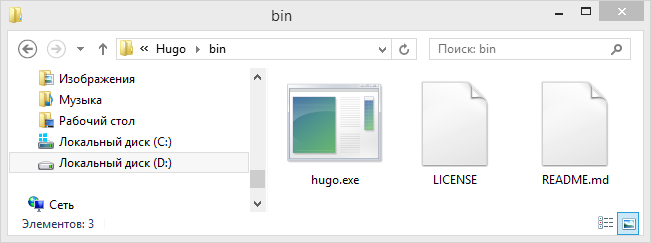
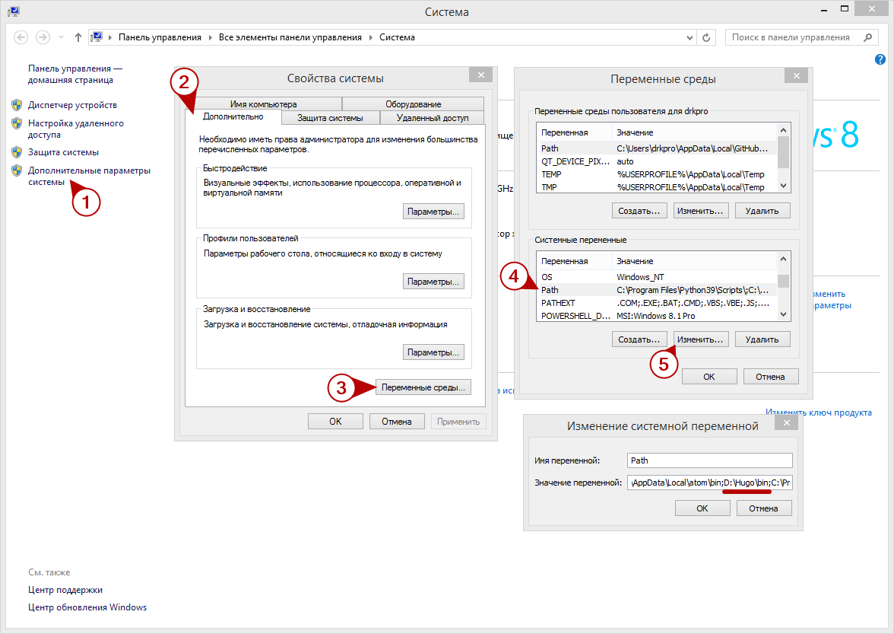
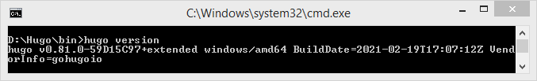
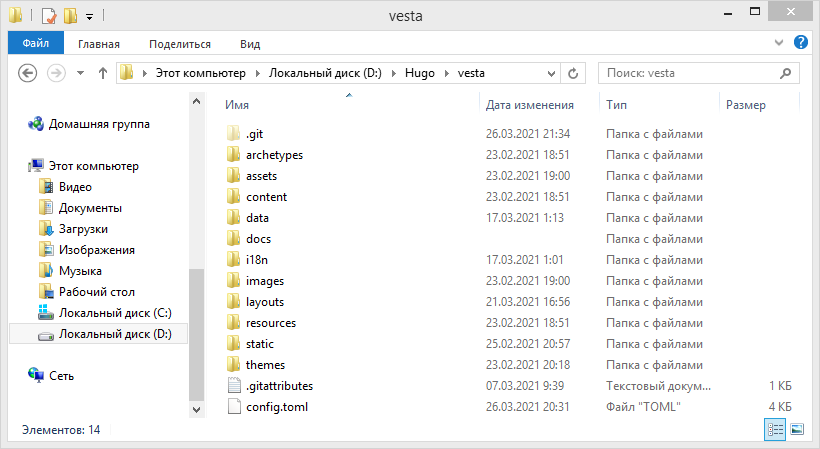
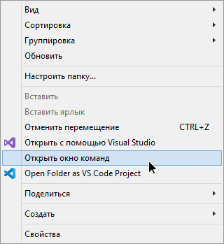
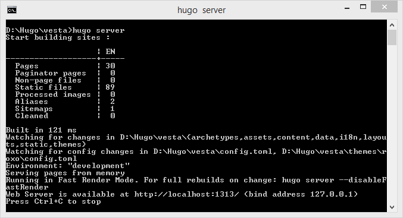
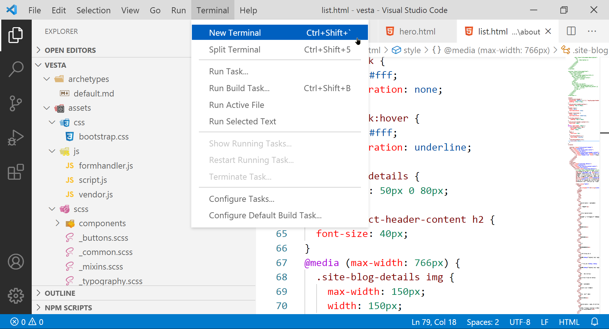
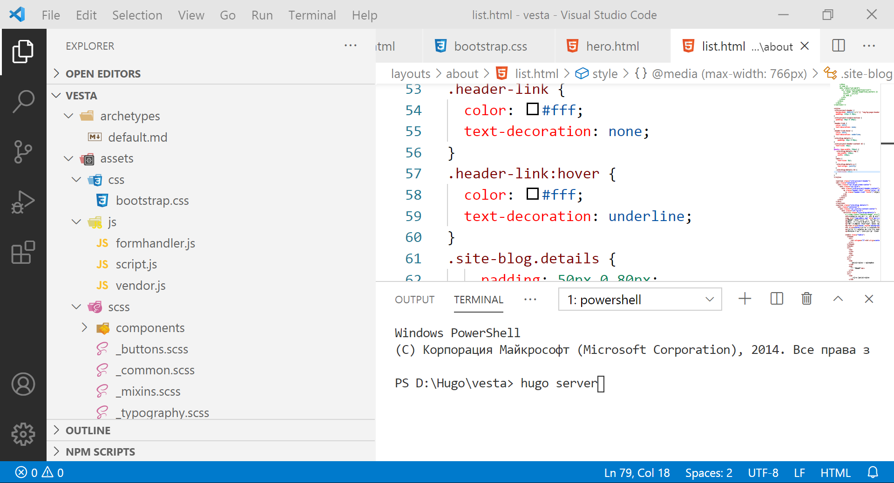
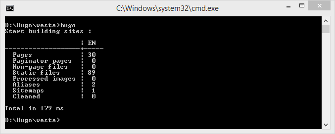
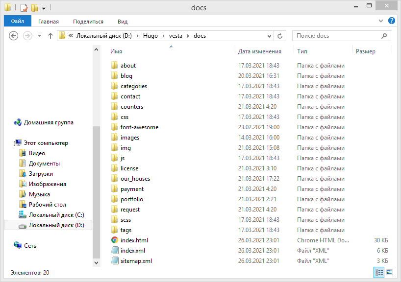

# README – ВЕБ-САЙТ ООО &quot;ВЕСТА&quot;
## ВВЕДЕНИЕ

Сайт собирается при помощи генератора статических сайтов **Hugo**.

Рекомендуемая версия генератора – [hugo\_extended\_0.81.0\_Windows-64bit](https://github.com/gohugoio/hugo/releases/download/v0.81.0/hugo_extended_0.81.0_Windows-64bit.zip), локальный архив с генератором находится в корне текущей папки, либо доступен для скачивания по гиперссылке.

**Hugo** – это генератор статических сайтов используемый через интерфейс командной строки и не имеет графического интерфейса, поэтому в качестве текстового редактора рекомендуется использовать [**Visual Studio Code**](https://code.visualstudio.com/), либо **Notepad++** вместе с командной строкой (`cmd.exe` или `PowerShell`).

Папка Resources содержит растровые логотипы, использованные на сайте, иконку и исходный векторный логотип (использованный шрифт – [**Montserrat**](https://fonts.google.com/specimen/Montserrat?preview.text_type=custom&amp;preview.text=%D0%92%D0%95%D0%A1%D0%A2%D0%90)).

Сайт так же использует фреймворк **Bootstrap** и набор иконок **FontAwesome**.

## РАЗВЕРТЫВАНИЕ ЛОКАЛЬНОГО ВЕБ-СЕРВЕРА

Локальный веб-сервер в первую очередь предназначен для тестирования, проверки работоспособности сайта и отлова ошибок. Так же он имеет функцию сборки сайта на лету, т.е. сайт будет собран заново после внесения изменений, это действие занимает миллисекунды.

Прежде чем начать развёртывание локального веб-сервера нужно загрузить дистрибутив Hugo рекомендуемой версии, указанной выше, после получения архива его нужно распаковать в любое место на вашем локальном диске (например, `D:\Hugo\bin`). В ней будет храниться исполняемый файл Hugo.

Далее нужно указать Hugo в переменных среды Windows, чтобы вы могли вызвать его из любой директории по ключевому слову `hugo`. Для выполнения данной операции перейдите в &quot;ПКМ по Этот Компьютер → Свойства → Дополнительные параметры системы → Свойства системы: Дополнительно → Переменные среды → Переменные среды: Системные переменные → ЛКМ по переменной Path → Изменить… → В значение переменной нужно указать путь к папке с установленным Hugo (например, `D:\Hugo\bin;`). Значение переменных должно разделятся символом точка с запятой (`;`), убедитесь в том, что вы ввели всё правильно и нажимайте ОК. Для большей наглядности вы можете воспользоваться следующей инструкцией:

Для проверки успешности установки Hugo следует открыть командную строку и написать `hugo version`, в ответ вы должны получить вашу текущую версию, коммит билда, его тип, платформу и информацию об авторе.

Если вместо ожидаемого ответа вы получили ошибку – проверьте ваши действия на этапе добавления переменной среды Windows и правильность введённой вами команды.

##### *На этом процесс установки Hugo завершён.*

Теперь вам нужно распаковать архив `vesta-master.zip`, он находится в текущей папке. Это папка с сайтом ООО &quot;ВЕСТА&quot; на Hugo.

Теперь вы можете развернуть локальный веб-сервер при помощи командной строки. Из папки с сайтов вызываем командную строку, сделать это можно как через проводник (Shift + ПКМ → Открыть окно команд), так и через терминал в Visual Studio Code при открытии папки vesta-master через Visual Studio Code.

В случае с использованием проводника выбираем пункт &quot;Открыть окно команд&quot; и пишем команду `hugo server`, в случае успеха сервер тут же поднимется по адресу [localhost:1313](http://localhost:1313/) либо по любому другому доступному на вашей машине порту. Интересующий вас локальный адрес будет выведен в командной строке.

В случае с использованием Visual Studio Code нужно сначала создать новый терминал, если у вас его нет.

Далее выполняем те же самые действия, описанные выше, но в терминале внутри Visual Studio Code.

##### *На этом процесс развертывания локального веб-сервера Hugo завершён.*

## СБОРКА ВЕБ-САЙТА ДЛЯ ПУБЛИКАЦИИ НА ХОСТИНГЕ

Для выгрузки веб-сайта на хостинг нужно собрать сайт в удобоваримую форму для веб-серверов. Просто загрузить исходную версию сайта на хостинг недостаточно. У вас уже должен быть установлен Hugo.

Для выполнения данной операции нужно выполнить команду `hugo`.

После выполнения данной команды по пути `vesta\docs` будет сгенерирована версия сайта для публикации на хостинге.

